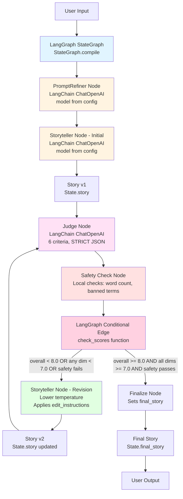

# Hippocratic AI Coding Assignment
Welcome to the [Hippocratic AI](https://www.hippocraticai.com) coding assignment

## Instructions
The attached code is a simple python script skeleton. Your goal is to take any simple bedtime story request and use prompting to tell a story appropriate for ages 5 to 10.
- Incorporate a LLM judge to improve the quality of the story
- Provide a block diagram of the system you create that illustrates the flow of the prompts and the interaction between judge, storyteller, user, and any other components you add
- Do not change the openAI model that is being used. 
- Please use your own openAI key, but do not include it in your final submission.
- Otherwise, you may change any code you like or add any files

### Supported Models (what to use)
- **Default**: OpenAI `gpt-3.5-turbo` (matches the assignment requirement). Simply provide `OPENAI_API_KEY` in `.env` and you are done.
- **Optional**: Google Gemini (defaults to `gemini-1.5-flash-latest`). Set `GOOGLE_API_KEY` and, if desired, override `GEMINI_MODEL`. Enable it explicitly via:
  ```bash
  export STORY_LLM_PROVIDER=gemini
  export GEMINI_MODEL=gemini-1.5-flash-latest
  ```
- `STORY_LLM_PROVIDER=auto` (default) picks whichever provider has a key configured, prioritising OpenAI to stay compliant with the brief.

---

## Rules
- This assignment is open-ended
- You may use any resources you like with the following restrictions
   - They must be resources that would be available to you if you worked here (so no other humans, no closed AIs, no unlicensed code, etc.)
   - Allowed resources include but not limited to Stack overflow, random blogs, chatGPT et al
   - You have to be able to explain how the code works, even if chatGPT wrote it
- DO NOT PUSH THE API KEY TO GITHUB. OpenAI will automatically delete it

---

## What does "tell a story" mean?
It should be appropriate for ages 5-10. Other than that it's up to you. Here are some ideas to help get the brain-juices flowing!
- Use story arcs to tell better stories
- Allow the user to provide feedback or request changes
- Categorize the request and use a tailored generation strategy for each category

---

## How will I be evaluated
Good question. We want to know the following:
- The efficacy of the system you design to create a good story
- Are you comfortable using and writing a python script
- What kinds of prompting strategies and agent design strategies do you use
- Are the stories your tool creates good?
- Can you understand and deconstruct a problem
- Can you operate in an open-ended environment
- Can you surprise us

---

## Other FAQs
- How long should I spend on this? 
No more than 2-3 hours
- Can I change what the input is? 
Sure
- How long should the story be?
You decide

---

## System Architecture

### Block Diagram

The system uses LangGraph to orchestrate a multi-agent workflow for generating safe, age-appropriate bedtime stories:



### Streamlit Frontend

Run a simple web UI without touching the CLI:

1. `pip install -r requirements.txt`
2. Configure your `.env` with `OPENAI_API_KEY` or `GOOGLE_API_KEY`
3. `streamlit run streamlit_app.py`
4. Fill in the form to generate stories, view judge feedback, and download the result as text.

### System Components

1. **PromptRefiner Node**: Converts raw user input into structured JSON brief with safety constraints
2. **Storyteller Node**: Generates stories in two modes:
   - **Initial**: Creates story from refined brief
   - **Revision**: Applies judge's edit instructions with lower temperature
3. **Judge Node**: Evaluates story on 6 dimensions (Age-fit, Clarity, Coherence, Safety/Positivity, Engagement, Length-fit) and returns STRICT JSON only
4. **Safety Check Node**: Performs local checks (word count 200-480, banned terms) without LLM calls
5. **Conditional Edge**: Routes based on quality thresholds:
   - **Stop**: overall >= 8.0 AND all dimensions >= 7.0 AND safety passes
   - **Continue**: Otherwise, if iteration_count < max_iterations

### Technology Stack

- **LangGraph**: Orchestration framework (https://docs.langchain.com/oss/python/langgraph/overview)
- **LangChain ChatOpenAI**: LLM integration
- **OpenAI GPT-3.5-turbo**: Model (exact from starter, centralized in config)

### Key Features

- **STRICT JSON parsing**: Judge returns JSON only, no Chain-of-Thought
- **Iterative refinement**: Up to 3 iterations to meet quality thresholds
- **Safety checks**: Local validation for word count and banned terms
- **Clear stop rules**: Prevents infinite loops with explicit conditions

---

## Detailed Overview & Capabilities

| Area | Details |
|------|---------|
| **LLM Orchestration** | LangGraph state machine converts messy user prompts → structured briefs → stories → judge feedback → safety validation. |
| **Few-shot Calibration** | `utils/prompts.py` seeds the Judge prompt with multiple summaries + “expected score” JSON. Those exemplars anchor rating baselines so the system knows what a *9.3 Safety* versus *5.0 Safety* looks like. |
| **Frontend Studio** | Streamlit layout with sticky setup card, tone chips, age stepper, safety badge, word-count indicator, and tweak radio buttons (e.g., “Cozy bedtime vibe”, “More sensory detail”). |
| **Feedback Loop** | Whenever a preset or custom change is selected, the same LangGraph run restarts in “revision mode”, passing the tweak text through the `feedback_request` field so the storyteller applies it deterministically. |
| **Downloads** | Stories can be exported as plain text (`bedtime_story.txt`). |

---

## Prompting & Few-Shot Strategy

1. **Prompt Refiner** – Enforces a canonical JSON schema and fills defaults (tone, length, banned topics). This keeps the rest of the system deterministic and resilient to missing user inputs.
2. **Storyteller** – Two modes:  
   - Initial generation (temperature 0.7) from the structured brief.  
   - Revision (temperature 0.3) that fuses judge/edit instructions *and* optional end-user tweaks.
3. **Judge** – Strict JSON output with six dimensions. The prompt embeds **few-shot examples** showing story summaries, target scores, and edit instructions so the model produces consistent numeric evaluations.
4. **Safety Check** – Local Python guard rails for word-count (200–480), banned phrases, and general positivity before sending text back to the UI.

---

## Setup

```bash
python -m venv venv
source venv/bin/activate            # Windows: venv\\Scripts\\activate
pip install --upgrade pip
pip install -r requirements.txt
```

Create a `.env` file:

```bash
# choose one provider (OpenAI is the assignment default)
OPENAI_API_KEY=sk-...
# or
GOOGLE_API_KEY=ya29....

# optional overrides
STORY_LLM_PROVIDER=auto   # auto | openai | gemini
GEMINI_MODEL=gemini-1.5-flash-latest
```

---

## Running the Project

### CLI (quick smoke test)
```bash
source venv/bin/activate
python main.py
```
Enter a topic, age, and tone; the script prints the story along with the judge JSON so you can verify the iterative loop.

### Streamlit “Bedtime Story Studio”
> **Choose your model before launching**  
> - Default OpenAI run (assignment-compliant): `export STORY_LLM_PROVIDER=auto` and ensure `.env` has only `OPENAI_API_KEY`.  
> - Gemini run:  
>   ```bash
>   export STORY_LLM_PROVIDER=gemini
>   export GEMINI_MODEL=gemini-1.5-flash-latest   # optional override
>   export GOOGLE_API_KEY=ya29...                # or set in .env
>   ```

```bash
source venv/bin/activate
streamlit run streamlit_app.py
```
Open the localhost URL → fill out the Setup card → click **Generate Story** → review the story, word-count pill, safety badge, and judge summary.  
When you need changes, pick a quick tweak or write custom feedback, hit **Apply feedback**, and a revised story appears. Download the result via the **Download** button.

### Model Selection Rules

| Condition | Provider used |
|-----------|---------------|
| `STORY_LLM_PROVIDER=auto` *(default)* and only `OPENAI_API_KEY` set | OpenAI `gpt-3.5-turbo` (per assignment instructions). |
| `STORY_LLM_PROVIDER=auto` and only `GOOGLE_API_KEY` set | Google Gemini using `GEMINI_MODEL` (defaults to `gemini-1.5-flash-latest`). |
| `STORY_LLM_PROVIDER` explicitly set to `openai` or `gemini` | Forces that backend if the corresponding key is configured. |

---


## Project Structure

```
.
├── graph/                # LangGraph definition & state model
├── nodes/                # Prompt refiner, storyteller, judge, safety, finalize
├── story_engine.py       # Helper that runs the compiled graph
├── streamlit_app.py      # Streamlit UI
├── utils/config.py       # Model selection + thresholds + banned terms
├── utils/prompts.py      # System prompts, including few-shot judge samples
├── main.py               # CLI entry point
├── requirements.txt
└── README.md
```

---
